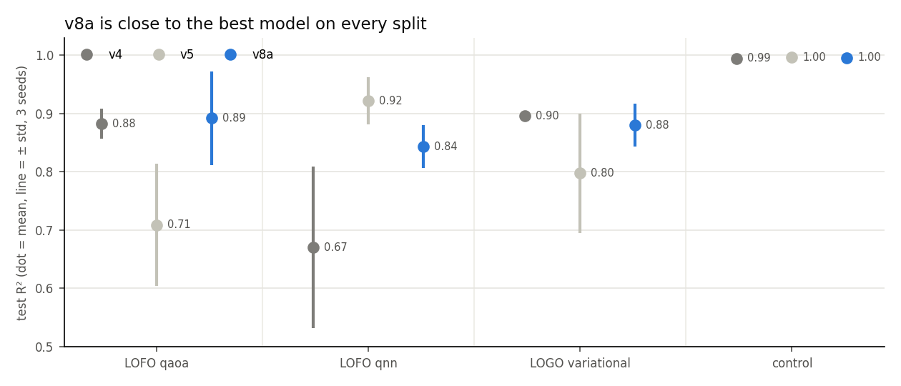
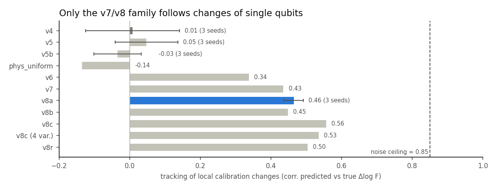
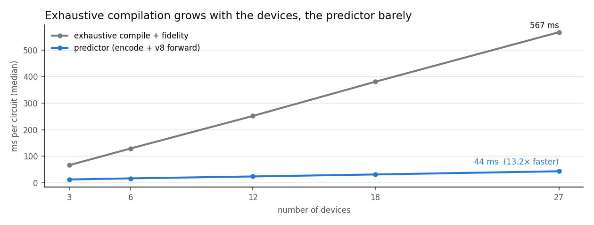

# Results — fidelity predictor study

*Generated by `evaluations/results_report.py` on 2026-10-09 17:28 UTC from the result files; do not edit by hand.*

**Main model: v8a** — v7 + loss on the true gate counts.

## Models

| Model | Idea | Status |
| --- | --- | --- |
| v4 | physics head + per-qubit attention | baseline |
| v5 | one-to-one Sinkhorn placement + chip distance | baseline |
| v5b | v5 + fixed budget, cosine LR, SWA | discarded |
| phys_uniform | v4 without placement (diagnostic) | diagnostic |
| v6 | v5 + loss on the compiler's exact layout | discarded |
| v7 | v5 + loss on used region and qubit distances | superseded |
| v8a | v7 + loss on the true gate counts | **main model** |
| v8b | v8a + calibration variants in training | discarded |
| v8c | v8a fine-tuned with a loss on the change of log F | pilot |
| v8c (4 var.) | v8c with 4 of the 8 calibration variants | test |
| v8r | v8a + routing-free flag (VF2 subgraph test) | 3 seeds running |
| v9 | v8r + per-device relative qubit features | running |
| v8r_cz | v8r + count loss weighted on cz (0.1 vs 0.01) | running |
| v8s | v8r_cz + greedy routing-cost estimate as input | running |
| v9f | v8r + the add-ons kept by the v9 decision | running |

## Generalization to unseen families

Test R², mean ± std (number of seeds).

| Model | LOFO qaoa | LOFO qnn | LOGO variational | variational: qnn | control |
| --- | --- | --- | --- | --- | --- |
| v4 | 0.882 ± 0.026 (3) | 0.670 ± 0.139 (3) | 0.896 ± 0.002 (3) | 0.782 ± 0.232 (3) | 0.995 ± 0.001 (3) |
| v5 | 0.709 ± 0.105 (3) | 0.922 ± 0.040 (3) | 0.798 ± 0.103 (3) | -0.330 ± 0.864 (3) | 0.996 ± 0.000 (3) |
| v5b | 0.609 ± 0.289 (3) | 0.906 ± 0.023 (3) | 0.800 ± 0.046 (3) | -0.928 ± 0.558 (3) | 0.996 ± 0.000 (3) |
| phys_uniform | 0.739 (1) | 0.897 (1) | 0.755 (1) | -1.933 (1) | 0.994 (1) |
| v6 | 0.822 (1) | 0.720 (1) | 0.774 (1) | 0.298 (1) | 0.995 (1) |
| v7 | 0.934 (1) | 0.615 (1) | 0.830 (1) | 0.268 (1) | 0.996 (1) |
| **v8a** | 0.892 ± 0.080 (3) | 0.843 ± 0.037 (3) | 0.880 ± 0.037 (3) | 0.403 ± 0.135 (3) | 0.996 ± 0.000 (3) |
| v8b | 0.844 (1) | 0.754 (1) | 0.801 (1) | -0.676 (1) | 0.997 (1) |
| v8c | – | – | – | – | 0.996 (1) |
| v8c (4 var.) | – | – | – | – | 0.996 (1) |
| v8r | 0.743 (1) | 0.948 (1) | 0.919 (1) | 0.892 (1) | 0.996 (1) |

## Calibration changes (low-noise test)

457 unseen circuits, truth = best of 5 compilations, control models. *Local* = single qubits/couplers change (shuffle, jitter σ 0.2–0.3); *moderate* = all errors ×0.7–1.3. Relative error 1.0 = as good as predicting no change. Mean over seeds.

| Model | seeds | local: tracking | local: worst R² | local: rel. error of ΔF | local: MAE of F | moderate: R² | moderate: tracking |
| --- | --- | --- | --- | --- | --- | --- | --- |
| v4 | 3 | 0.01 | 0.409 | 1.72 | 0.037 | 0.991 | 0.98 |
| v5 | 3 | 0.05 | 0.909 | 1.05 | 0.022 | 0.994 | 0.97 |
| v5b | 3 | -0.03 | 0.949 | 0.97 | 0.023 | 0.992 | 0.90 |
| phys_uniform | 1 | -0.14 | 0.942 | 1.00 | 0.027 | 0.987 | 0.98 |
| v6 | 1 | 0.34 | 0.968 | 0.86 | 0.023 | 0.991 | 0.93 |
| v7 | 1 | 0.43 | 0.980 | 0.75 | 0.020 | 0.994 | 0.96 |
| **v8a** | 3 | 0.46 | 0.965 | 0.73 | 0.020 | 0.993 | 0.96 |
| v8b | 1 | 0.45 | 0.983 | 0.61 | 0.016 | 0.993 | 0.91 |
| v8c | 1 | 0.56 | 0.981 | 0.64 | 0.018 | 0.993 | 0.97 |
| v8c (4 var.) | 1 | 0.53 | 0.977 | 0.67 | 0.019 | 0.992 | 0.96 |
| v8r | 1 | 0.50 | 0.976 | 0.71 | 0.020 | 0.992 | 0.96 |

## Inference time vs exhaustive compilation

288 circuits, 1 thread, circuit already in memory; devices = 3 originals + calibration variants. Graph encoding 11.2 → 2.2 ms (`gsv3/fast_encoding.py`).

| Devices | Exhaustive (ms) | Predictor (ms) | Speed-up (median per circuit) |
| --- | --- | --- | --- |
| 3 | 66.7 | 12.9 | 5.4× |
| 6 | 129.3 | 17.0 | 7.8× |
| 12 | 251.8 | 24.2 | 10.7× |
| 18 | 380.4 | 31.7 | 12.2× |
| 27 | 566.7 | 43.8 | 13.2× |

Details, diagnostics and decisions: `evaluations/TODO.md`.
